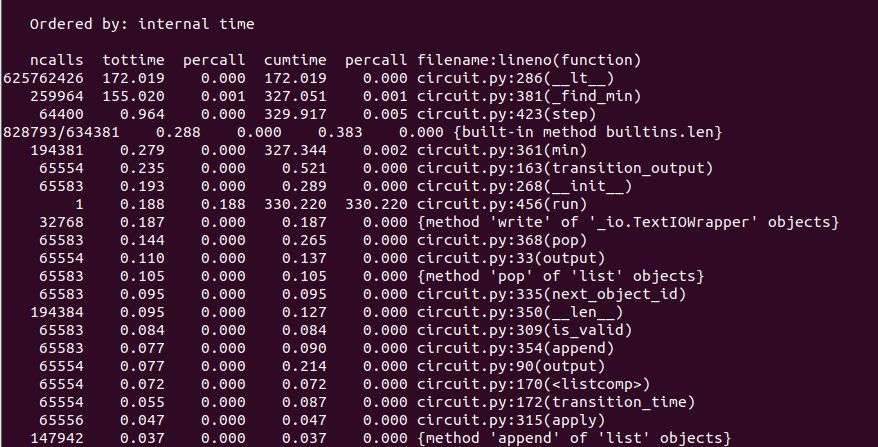

- 第一题最终的结果：不使用硬件加速，使用纯软件渲染的算法复杂度更低。这最初看似不合理，但仔细想想之后是有道理的
  - 参考一个对该问题的讨论：[fractals - Asymptotic rendering time for koch snowflakes - Mathematics Stack Exchange](https://math.stackexchange.com/questions/1594225/asymptotic-rendering-time-for-koch-snowflakes)
  - 硬件加速虽然使算法复杂度上升，但是实际的渲染工作是由GPU完成的，CPU的计算被免除，从而实现”加速“
  - 另一个角度的原因是本例很特殊：随着调用的层数的增加，每个节点需要需要画的长度/面积越来越小，因此软件渲染的计算时间也是随着层数增加逐渐变少，但GPU的计算时间不会随着层数增加，长度/面积减少而变少。在正常情况下，每个要画的图形大小没有理由随指数递减。

- 第一题中学到的，主要是树形调用结构的复杂度计算思路：层数、节点数，每个节点的计算复杂度->总复杂度

- 第二题似乎不用转换成python2也能运行，在题干里描述需要15-30分钟，但2018年的普通i5+虚拟机翻译指令只花5分钟就能完成

可见`PriorityQueue`的`find_min`方法花费了较多时间，它被调用了260k次，每次都遍历找最小。

sol代码中，堆的实现方式可以看一下，在数组的0位不放东西，从1位开始放，小技巧。
