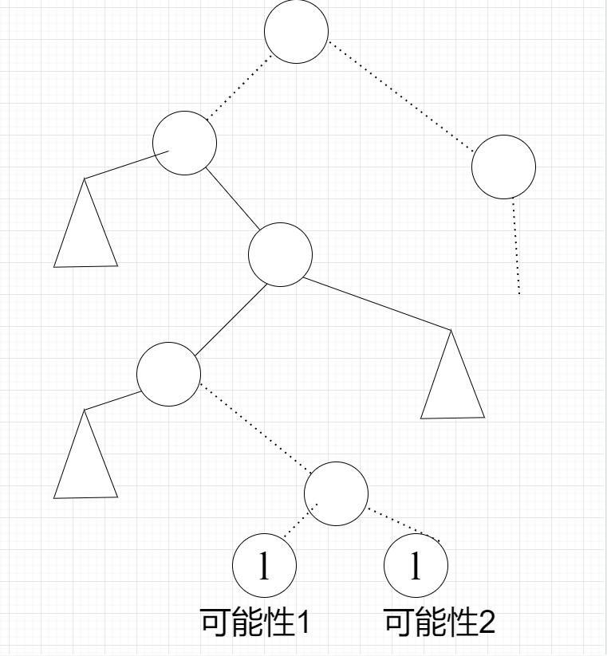
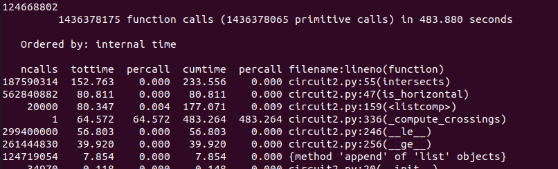
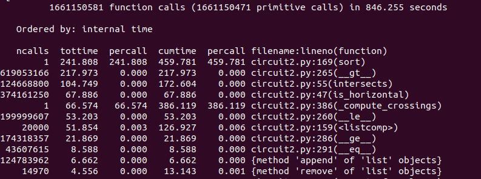
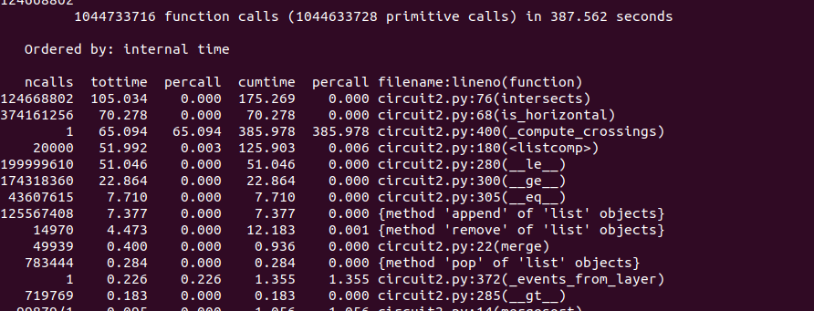
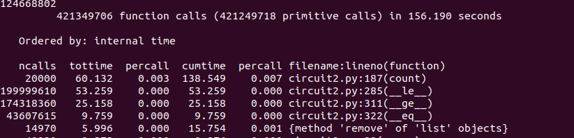
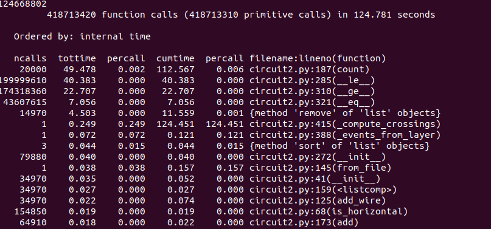

## 第一题

看着挺简单但其实值得深思

**j：**内存空间，下意识地认为：因为都是unsigned，所以是O(1)，但严格来讲，如果大于MAX_UNSIGNED的话，就需要更多的空间，所以是O（logN）


**k-n：**数据增强的方式，节点中的<u>新属性</u>究竟是它子节点的数量，还是子节点+自己的数量？

- 如果是子节点的数量，那么<u>最下面的一层</u>的该属性都是0（因为最下面的一层的节点不再有子节点了），这样倒数第二层的也是0，所以不合理，得是子节点+自己的数量
- 计算公式为  当前节点=左+右+1   null指针=0


**o：**什么时候更改节点的属性？这涉及到AVL的插入和删除算法，插入时，AVL先将节点放入合适的位置，再调用Balance<u>，是在balance中发生高度的调整，所以也应当把节点属性更新放进这里</u>


**s：**这里要好好想清楚，为什么是O(logN)+O(L)

- 为什么LCA意味着lowest common ancestors，common是谁之间common
  - 是搜索路线的common！！
  - LCA是**第一个**满足l<lca<h的节点，而不是**最后一个**！
  - LCA returns the root of the smallest sub-tree that contains both l and h. 
- sol中提供了分析思路：把l和h作为虚拟节点插入AVL，并且不进行balance，这种方法很重要
- l和h为什么一定分别在lca的左侧和右侧？
  - 反证法，如果l和h都在左侧，那么h<lca.value那么lca并不满足条件
- 为什么是为什么是O(logN)+O(L)
  - 答案里写得很详细，重要的思想是把节点分成两类：会调用ADD的，这样就属于O（L）和不会调用ADD的
  - 自己的分析方法是画这种东西，把从lca到l的路径抽象出来，哪些节点会被计算，哪些节点不会被计算，哪些节点会调用ADD，哪些节点不会，等等...
  - 

- 这个问题&解决方法本身就很有意思，第6页的题干里首先指出了，<u>只要调用LIST（-inf,inf）就可知该问题必然是$\Omega(N$​​​​)的</u>，但是还是希望在小的范围内得到次线性的复杂度，核心的解决方法就是LCA，LCA只计算一次，之后的计算都从LCA出发，这样可以降低复杂度。


这节ps还多次提到了不变性 invariant，是一个抽象的概念

- 结构的不变性，比如AVL左右节点的相对大小，一定有左<当前节点<右
- 算法不变性：算法在处理不同对象时共通的部分，比如上面提到的，节点的$\gamma$=左节点的$\gamma$+右节点$\gamma$​+1，这对于图中的根节点，普通节点，最底层节点都是一样的，所以是invariant
- 算法的核心其实也就在于掌握invariant，表示出某种计算机能够get的规律


## 第二题

最初版本



第一次改造

- 改了sweep-line的实现算法

- 使用插入排序
- 重载gt运算符：为了保证在横线最右侧和竖线的x坐标重合时，query和remove的顺序是：先query，再remove，从而保证横线最右侧与竖线的交点能被get到



第二次改造

- 改为归并排序 递归版本
- 改进了重载gt运算符的逻辑，简化了逻辑表达式



第三次改造

- 发现第一次改造sweep-line算法过于复杂，因为自己没有完全理解：因为已经实现动态的横线的增删了，没有必要进行相交检查，所有可查到的都是相交的



第四次改造

- 发现自己重新造了一遍轮子，完全没有理解到python sort函数的强大



python排序结构体的方法

```      python
self.events = []

for wire in layer.wires.values():
    
if wire.is_horizontal():
 self.events.append([wire.x1, 0, wire.object_id, 'add', wire])
 self.events.append([wire.x2, 2, wire.object_id, 'remv', wire])
else:
 self.events.append([wire.x1, 1, wire.object_id, 'query', wire])

self.events.sort()

```

最后一行，调用python自带的sort，排序逻辑是：先按第一个（wire.x)排，第一个相等时，按第二个排，所以，当某个remv对象和某个query对象的第一个值相等时，因为remv类型的结构体第二个值都是2，所以有remv>query


我为了实现这个功能

- 显示地设置了另一个结构体，增加了一位数据
- 增加的这一位是字符
- 重载运算符，进行字符串判断
- 手写了sort算法，结合上面的重载运算符


反思

- 应当先了解python的sort
- 在结构体中增加一位辅助信息的思路是对的，但是使用数字就行，使用字符+重载运算符麻烦了
- 重载运算符，使用的是类之间的对比，计算耗时，上面的结构体使用的是数之间的对比，应当把逻辑放到排序算法中而不是重载运算符中比较好。

